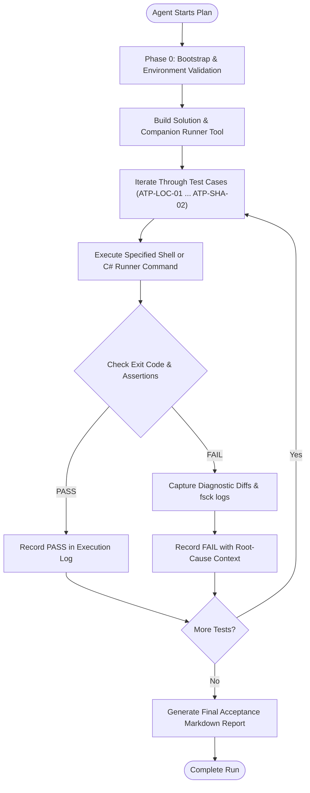

# Pmad.Git Acceptance & Conformance Test Plan

> **Target Suite**: `Pmad.Git.LocalRepositories`, `Pmad.Git.RemoteClient`, `Pmad.Git.Protocol`, `Pmad.Git.Cli`, `Pmad.Git.HttpServer`  
> **Target Framework**: .NET 8 / C# 12  
> **Execution Mode**: Autonomous AI Agent Playbook & Continuous Verification  
> **Reference Oracle**: Native Git CLI (`git` >= 2.30)  
> **Required Platform**: Linux (all scratch repositories must live under `/tmp/pmad_acceptance/`)  
> **Status**: Ready for Automated Execution  

---

## 1. Executive Summary & Objective

The goal of this Acceptance Test Plan is to establish unwavering confidence in the **reliability, specification conformance, and production-grade stability** of the `Pmad.Git` library suite. 

Unlike conventional unit test suites, this acceptance plan employs **differential testing (oracle verification)**:
1. Every write operation performed by `Pmad.Git` is independently verified by native `git fsck --full --strict` and `git status`.
2. Every inspection query (working tree status, tree hierarchy, commit ancestry, diff stats, reference resolution) is compared bit-for-bit against native `git` CLI outputs.
3. Remote synchronization is tested across real-world repositories (such as [curl/curl](https://github.com/curl/curl) and [jetelain/PmadGit](https://github.com/jetelain/PmadGit)) as well as complex synthetic testbeds exhibiting edge cases (SHA-256 object formats, canonical directory sorting, binary payloads, deep delta chains, and UTF-8 multi-byte paths).
4. Both client and server implementations are pitted against native Git: native Git clones and pushes to `Pmad.Git.HttpServer`, while `Pmad.Git.RemoteClient` clones and pushes to remote Git servers without any native CLI dependencies.

---

## 2. Automated AI Agent Execution Instructions

This document is engineered as a deterministic, machine-executable runbook. An AI agent conducting this test plan must adhere to the following execution loop:



### AI Agent Rules of Engagement
1. **Directory Isolation (Linux, `/tmp` workspace required)**: This plan **must** be executed on **Linux**. All temporary test repositories must be created under the dedicated workspace directory `/tmp/pmad_acceptance/`. Relative workspaces inside the source tree (e.g. `./.acceptance_work/`) and Windows-specific locations (`$env:TEMP`) are **forbidden**. The source repository itself must never be modified except when testing read-only inspection.
   ```bash
   mkdir -p /tmp/pmad_acceptance
   ```
2. **Strict Verification Invariant**: Any test case involving state modification (staging, commit, reset, push, unpack) **MUST** execute `git fsck --full --strict` as a mandatory validation gate. Any `fsck` error, corrupt link, or dangling object warning constitutes a test failure.
3. **Structured Exit Codes**: The companion tool (`tools/Pmad.Git.Acceptance`) returns:
   - `0`: Success (100% conformance with native Git).
   - `1`: Validation Failure (mismatch detected, exact diff printed to stderr/stdout).
   - `2`: Invalid CLI arguments or syntax.
4. **Final Deliverable**: Upon completing all phases, generate an `ACCEPTANCE_REPORT.md` summarizing pass/fail counts, real-world repository metrics, execution durations, and any discrepancies discovered.
5. **Differential Repositories Must Be Checked Out Without Line-Ending Conversion**: `Pmad.Git` does **not** implement Git's text / line-ending normalization (`core.autocrlf`, `core.eol`, `text` gitattributes). Any repository used for differential (oracle) queries — `compare-status`, working-tree-based tree comparisons — must be cloned or re-checked-out with conversion disabled so that on-disk bytes are bit-identical to blob bytes:
   ```bash
   git clone -c core.autocrlf=false <url> <target>
   git -C <target> config core.autocrlf false
   ```
   If the working tree was checked out with CRLF conversion enabled, the managed status engine reports every CRLF-normalized file as *Modified* while native `git status` reports *clean*. This is an environment artifact, not a Pmad.Git defect. **Finding (run 2026-09-25)**: ATP-IDX-01 initially produced 326 false-positive mismatches until the scratch clone was re-created with `core.autocrlf=false`.

---

## 3. Test Matrix & Golden Invariants

| Category | Identifier Range | Scope / Target Package | Primary Validation Oracle |
|:---|:---|:---|:---|
| **Local Storage & Traversal** | `ATP-LOC-01` – `ATP-LOC-06` | `Pmad.Git.LocalRepositories` | `git ls-tree`, `git cat-file`, `git show-ref`, `git log` |
| **Index & Working Tree** | `ATP-IDX-01` – `ATP-IDX-06` | `Pmad.Git.LocalRepositories` (DIRC v2) | `git status --porcelain=v2`, `git diff --cached` |
| **Workspace Mutators** | `ATP-MUT-01` – `ATP-MUT-06` | Workspace Commit, Amend, Reset, Squash, Revert | `git fsck --full --strict`, `git log -1` |
| **Diff & 3-Way Merge** | `ATP-MRG-01` – `ATP-MRG-04` | `MyersDiff`, `Diff3Merge`, Virtual Merge Bases | `git merge-file`, `git merge-base`, `git diff -u` |
| **Smart HTTP Server** | `ATP-SRV-01` – `ATP-SRV-05` | `Pmad.Git.HttpServer`, `Pmad.Git.Protocol` | Native `git clone`, `git fetch`, `git push` |
| **Managed Remote Client** | `ATP-CLI-01` – `ATP-CLI-05` | `Pmad.Git.RemoteClient` (Zero CLI) | Native `git log`, `git fsck`, GitHub Smart HTTP |
| **Decentralized Sync** | `ATP-SNC-01` – `ATP-SNC-03` | `GitRepositorySynchronizer` | Concurrent multi-client push/pull |
| **Native CLI Wrapper** | `ATP-WRP-01` – `ATP-WRP-03` | `Pmad.Git.Cli` | `git rev-list --left-right`, `git show --stat` |
| **SHA-256 Modern Repos** | `ATP-SHA-01` – `ATP-SHA-02` | 32-byte object hashes, Pack Index v2 | `git init --object-format=sha256`, `git fsck` |

---

## 4. Companion Tooling: `Pmad.Git.Acceptance`

To facilitate autonomous execution by AI agents, a dedicated multi-command runner tool is provided at [`tools/Pmad.Git.Acceptance`](file:///tools/Pmad.Git.Acceptance/Program.cs).

### Invocation Pattern
```bash
dotnet run --project tools/Pmad.Git.Acceptance -- <command> [arguments]
```

### Built-in Subcommands
- `compare-status <repoPath>`: Performs differential comparison between `GitRepositoryWithIndexAndWorkspace.GetStatusAsync()` and `git status --porcelain=v2`. Returns `0` if identical; prints mismatches and returns `1` otherwise.
- `compare-tree <repoPath> [commitIsh]`: Recursively walks commit tree via `EnumerateCommitTreeAsync()` and compares entry count, paths, file modes (100644, 100755, 040000, 120000), and SHA hashes against `git ls-tree -r -t`.
- `compare-refs <repoPath>`: Verifies that all references (loose, packed, HEAD, branches, tags) resolved by `GitReferenceStore` match `git show-ref` and `git rev-parse`.
- `verify-fsck <repoPath>`: Runs `git fsck --full --strict` and validates zero corruptions or warnings.
- `managed-commit <repoPath> <relPath> <content> <commitMsg>`: Stages and commits a file using pure managed code, followed by immediate `git fsck` verification.
- `managed-amend <repoPath> <relPath> <content> <commitMsg>`: Amends the tip commit using pure managed code, verifying index stat updates and tree consistency.
- `managed-reset <repoPath> <commitIsh> <Soft|Mixed|Hard>`: Executes managed reset and verifies working tree and index fidelity.
- `managed-squash <repoPath> <baseCommitIsh> <msg>`: Squashes a linear range of commits into a milestone commit and asserts ancestor reachability.
- `managed-revert <repoPath> <commitIsh>`: Inverts a commit cleanly against the working tree and index.
- `serve-repo <repoRoot> <port>`: Starts an in-process ASP.NET Core `Pmad.Git.HttpServer` listening on `http://127.0.0.1:<port>` with push and upload-pack enabled.
- `client-clone <url> <targetPath> [branch]`: Performs pure managed clone via `GitRemoteClientRepository.CloneAsync` and runs native `git fsck`.
- `client-pull <repoPath>`: Performs pure managed fetch and 3-way merge via `GitRemoteClientRepository.PullAsync`.
- `client-push <repoPath>`: Generates thin pack and pushes via `GitRemoteClientRepository.PushAsync`.
- `create-synthetic-repo <targetPath> [--sha256]`: Generates a repository equipped with canonical tree sorting edge cases, executable bits, binary payloads, non-ASCII filenames, `.gitignore` rules, and branch tags.

---

## 5. Target Repositories

### Target 1: Self-Repository (`PmadGit`)
- **Characteristics**: Real-world .NET 8 multi-project repository.
- **Traits Tested**: Packed refs, deep commit history, solution/project files, mixed LF/CRLF line endings, nested directories (`src/`, `tests/`, `docs/`).
- **Location**: Current working directory `.` (Read-only inspection tests).

### Target 2: High-Density Real-World Remote (`curl/curl` or `jqlang/jq`)
- **Characteristics**: Large-scale C projects with >30,000 commits, >100 release tags, submodules, executable shell scripts (`100755`), and symlinks.
- **Acquisition Command**:
  ```bash
  git clone --depth 50 https://github.com/curl/curl.git /tmp/pmad_acceptance/curl_repo
  ```
- **Traits Tested**: High-speed tree traversal, packed-refs parsing, delta resolution, tag dereferencing, multi-author signatures.

### Target 3: Synthetic Edge-Case Repository (`synthetic-sha1` & `synthetic-sha256`)
- **Characteristics**: Custom generated repository isolating Git protocol and storage edge cases.
- **Traits Tested**:
  1. **Canonical Tree Sorting Collision**: File and directory names sharing prefixes:
     - `dir-other.txt`
     - `dir.txt`
     - `dir/child.txt` (Directory sorting rule: compared with trailing `/`)
     - `dir0.txt`
     - `dir_other.txt`
  2. **File Permissions**: Normal (`100644`) vs Executable (`100755`).
  3. **Binary Content**: 64KB arbitrary binary buffer containing all byte values 0x00–0xFF.
  4. **Multi-byte Unicode Paths**: Non-ASCII filenames (`unicode-éàç-utf8.txt`).
  5. **Complex `.gitignore` Patterns**: Directory exclusion, wildcard matching, and negated re-inclusion (`*.log`, `build/`, `!build/keep.txt`).
  6. **SHA-256 Object Format**: 32-byte hashes across commit, tree, and blob objects.

---

## 6. Acceptance Test Playbook (Phase-by-Phase)

### Phase 0: Environment Bootstrap

The AI agent executes this phase first to confirm environment readiness.

> **Platform Requirement**: This phase **must** run on **Linux**. Execute commands from the repository root with a standard bash shell (no PowerShell). All scratch artifacts live under `/tmp/pmad_acceptance/`.

```bash
# Step 0.1: Verify .NET 8 SDK
dotnet --version

# Step 0.2: Verify Native Git CLI
git --version

# Step 0.3: Build entire solution including acceptance runner
dotnet build Pmad.Git.sln -c Release

# Step 0.4: Create clean scratch directory under /tmp
rm -rf /tmp/pmad_acceptance
mkdir -p /tmp/pmad_acceptance
```
**Pass Criteria**: Running platform is Linux; `dotnet` and `git` commands exit `0`; solution builds with `0 errors`; `/tmp/pmad_acceptance/` exists and is empty.

---

### Phase 1: Local Storage, Tree Traversal & Reference Conformance

#### ATP-LOC-01: Reference Resolution & HEAD Peeling
- **Target**: Self-repository (`.`)
- **Action**: Compare resolved references between `GitReferenceStore` and native `git show-ref`.
- **Command**:
  ```bash
  dotnet run --project tools/Pmad.Git.Acceptance -c Release -- compare-refs .
  ```
- **Verification**: Exit code `0`. All branches, tags, and HEAD commit hashes match `git rev-parse` exactly.

#### ATP-LOC-02: Recursive Tree Walk & Hash Equality
- **Target**: Self-repository (`.`)
- **Action**: Enumerate every blob and tree entry via `EnumerateCommitTreeAsync()` and compare against `git ls-tree -r -t HEAD`.
- **Command**:
  ```bash
  dotnet run --project tools/Pmad.Git.Acceptance -c Release -- compare-tree . HEAD
  ```
- **Verification**: Exit code `0`. Entry count, file modes (100644 vs 100755 vs 040000), path strings, and object hashes are identical.

#### ATP-LOC-03: Real-World Deep History Clone & Traversal
- **Target**: `curl/curl` (Shallow clone depth 50)
- **Command**:
  ```bash
  git clone --depth 50 https://github.com/curl/curl.git /tmp/pmad_acceptance/curl_repo
  dotnet run --project tools/Pmad.Git.Acceptance -c Release -- compare-refs /tmp/pmad_acceptance/curl_repo
  dotnet run --project tools/Pmad.Git.Acceptance -c Release -- compare-tree /tmp/pmad_acceptance/curl_repo HEAD
  ```
- **Verification**: Exit code `0` on both queries. Demonstrates reliable packed-refs resolution and tree walking on a non-trivial third-party open-source repository.

#### ATP-LOC-04: Canonical Tree Sorting Rule Enforcement
- **Target**: `/tmp/pmad_acceptance/synthetic_sort`
- **Action**: Create synthetic repo with files sharing identical prefixes with directories.
- **Command**:
  ```bash
  dotnet run --project tools/Pmad.Git.Acceptance -c Release -- create-synthetic-repo /tmp/pmad_acceptance/synthetic_sort
  dotnet run --project tools/Pmad.Git.Acceptance -c Release -- verify-fsck /tmp/pmad_acceptance/synthetic_sort
  ```
- **Verification**: Exit code `0`. `git fsck --full --strict` reports no `"contains unsorted entries"` or tree corruption errors.

---

### Phase 2: Index (DIRC v2), Staging & Working Tree Status

#### ATP-IDX-01: Working Tree Status Differential Oracle
- **Target**: `/tmp/pmad_acceptance/status_repo`
- **Action**: Generate modified, untracked, staged, and deleted files, then compare Pmad.Git status with `git status --porcelain=v2`.
- **Command**:
  ```bash
  git clone . /tmp/pmad_acceptance/status_repo
  # Create dirty state
  echo "untracked" > /tmp/pmad_acceptance/status_repo/new_untracked.txt
  echo "dirty line" >> /tmp/pmad_acceptance/status_repo/README.md
  git -C /tmp/pmad_acceptance/status_repo add README.md
  echo "unstaged second line" >> /tmp/pmad_acceptance/status_repo/README.md
  dotnet run --project tools/Pmad.Git.Acceptance -c Release -- compare-status /tmp/pmad_acceptance/status_repo
  ```
- **Verification**: Exit code `0`. Discrepancy count is `0`. Both engines report identical staged and unstaged states.

#### ATP-IDX-02: Interleaved Staging Conformance
- **Target**: `/tmp/pmad_acceptance/interleaved_repo`
- **Action**: Stage file A via Pmad.Git managed code, stage file B via native `git add`, unstage file A via Pmad.Git, and verify index bit fidelity.
- **Command**:
  ```bash
  git init /tmp/pmad_acceptance/interleaved_repo
  echo "alpha" > /tmp/pmad_acceptance/interleaved_repo/fileA.txt
  echo "beta" > /tmp/pmad_acceptance/interleaved_repo/fileB.txt
  dotnet run --project tools/Pmad.Git.Acceptance -c Release -- managed-commit /tmp/pmad_acceptance/interleaved_repo fileA.txt "alpha" "Add A"
  git -C /tmp/pmad_acceptance/interleaved_repo add fileB.txt
  git -C /tmp/pmad_acceptance/interleaved_repo status --porcelain
  dotnet run --project tools/Pmad.Git.Acceptance -c Release -- compare-status /tmp/pmad_acceptance/interleaved_repo
  ```
- **Verification**: Exit code `0`. `git status` confirms clean handoff between managed DIRC v2 engine and native Git.

#### ATP-IDX-03: Stat Cache Matching & Short-Circuit Hashing
- **Target**: `/tmp/pmad_acceptance/status_repo`
- **Action**: Touch file timestamps without altering byte contents. Verify that `GetStatusAsync` leverages the index stat cache (`mtime`, `fileSize`, `ctime`) without marking unchanged files as modified.
- **Command**:
  ```bash
  touch /tmp/pmad_acceptance/status_repo/README.md
  dotnet run --project tools/Pmad.Git.Acceptance -c Release -- compare-status /tmp/pmad_acceptance/status_repo
  ```
- **Verification**: Exit code `0`. File is correctly recognized as clean or verified via fallback hash check.

---

### Phase 3: Workspace Lifecycle Operations (Commit, Amend, Reset, Squash, Revert)

#### ATP-MUT-01: Managed Commit & Amend with Tree Rewrite
- **Target**: `/tmp/pmad_acceptance/mut_repo`
- **Action**: Author initial commit, then amend commit message and add extra files via managed code.
- **Command**:
  ```bash
  git init /tmp/pmad_acceptance/mut_repo
  dotnet run --project tools/Pmad.Git.Acceptance -c Release -- managed-commit /tmp/pmad_acceptance/mut_repo test.txt "v1" "Initial commit"
  dotnet run --project tools/Pmad.Git.Acceptance -c Release -- managed-amend /tmp/pmad_acceptance/mut_repo test.txt "v2" "Amended initial commit"
  git -C /tmp/pmad_acceptance/mut_repo log -1 --pretty=%B
  dotnet run --project tools/Pmad.Git.Acceptance -c Release -- verify-fsck /tmp/pmad_acceptance/mut_repo
  ```
- **Verification**: Exit code `0`. Git log outputs `"Amended initial commit"`. `fsck` reports clean repository.

#### ATP-MUT-02: Managed Soft, Mixed, and Hard Resets
- **Target**: `/tmp/pmad_acceptance/reset_repo`
- **Action**: Author 3 commits, reset back to commit 1 using `GitResetMode.Hard`.
- **Command**:
  ```bash
  git init /tmp/pmad_acceptance/reset_repo
  dotnet run --project tools/Pmad.Git.Acceptance -c Release -- managed-commit /tmp/pmad_acceptance/reset_repo f1.txt "1" "C1"
  c1=$(git -C /tmp/pmad_acceptance/reset_repo rev-parse HEAD)
  dotnet run --project tools/Pmad.Git.Acceptance -c Release -- managed-commit /tmp/pmad_acceptance/reset_repo f2.txt "2" "C2"
  dotnet run --project tools/Pmad.Git.Acceptance -c Release -- managed-commit /tmp/pmad_acceptance/reset_repo f3.txt "3" "C3"
  dotnet run --project tools/Pmad.Git.Acceptance -c Release -- managed-reset /tmp/pmad_acceptance/reset_repo "$c1" Hard
  head=$(git -C /tmp/pmad_acceptance/reset_repo rev-parse HEAD)
  if [ "$head" != "$c1" ]; then echo "FAIL: Reset did not point HEAD to C1" >&2; exit 1; fi
  dotnet run --project tools/Pmad.Git.Acceptance -c Release -- compare-status /tmp/pmad_acceptance/reset_repo
  ```
- **Verification**: Working tree is clean. `f2.txt` and `f3.txt` are purged from disk. `fsck` passes.

#### ATP-MUT-03: Commit Range Squash (`SquashRangeAsync`)
- **Target**: `/tmp/pmad_acceptance/squash_repo`
- **Action**: Squash commits `base..HEAD` into single milestone commit.
- **Command**:
  ```bash
  git init /tmp/pmad_acceptance/squash_repo
  dotnet run --project tools/Pmad.Git.Acceptance -c Release -- managed-commit /tmp/pmad_acceptance/squash_repo base.txt "b" "Base commit"
  base=$(git -C /tmp/pmad_acceptance/squash_repo rev-parse HEAD)
  dotnet run --project tools/Pmad.Git.Acceptance -c Release -- managed-commit /tmp/pmad_acceptance/squash_repo feat1.txt "1" "Feature 1"
  dotnet run --project tools/Pmad.Git.Acceptance -c Release -- managed-commit /tmp/pmad_acceptance/squash_repo feat2.txt "2" "Feature 2"
  dotnet run --project tools/Pmad.Git.Acceptance -c Release -- managed-squash /tmp/pmad_acceptance/squash_repo "$base" "Squashed Milestone"
  git -C /tmp/pmad_acceptance/squash_repo rev-list --count HEAD
  dotnet run --project tools/Pmad.Git.Acceptance -c Release -- verify-fsck /tmp/pmad_acceptance/squash_repo
  ```
- **Verification**: Total commit count is `2`. Native `git diff HEAD~1..HEAD` contains both `feat1.txt` and `feat2.txt`.

#### ATP-MUT-04: Commit Inversion Revert (`RevertAsync`)
- **Target**: `/tmp/pmad_acceptance/revert_repo`
- **Action**: Author a commit adding `bad.txt`, then invert using `RevertAsync`.
- **Command**:
  ```bash
  git init /tmp/pmad_acceptance/revert_repo
  dotnet run --project tools/Pmad.Git.Acceptance -c Release -- managed-commit /tmp/pmad_acceptance/revert_repo base.txt "b" "Base"
  dotnet run --project tools/Pmad.Git.Acceptance -c Release -- managed-commit /tmp/pmad_acceptance/revert_repo bad.txt "bad" "Bad Feature"
  bad_hash=$(git -C /tmp/pmad_acceptance/revert_repo rev-parse HEAD)
  dotnet run --project tools/Pmad.Git.Acceptance -c Release -- managed-revert /tmp/pmad_acceptance/revert_repo "$bad_hash"
  if [ -e /tmp/pmad_acceptance/revert_repo/bad.txt ]; then echo "FAIL: bad.txt still exists after revert" >&2; exit 1; fi
  dotnet run --project tools/Pmad.Git.Acceptance -c Release -- verify-fsck /tmp/pmad_acceptance/revert_repo
  ```
- **Verification**: `bad.txt` is cleanly deleted from disk and index. `git log -1` confirms revert commit.

---

### Phase 4: Diff Algorithms & 3-Way Merge Conformance

#### ATP-MRG-01: In-Memory 3-Way Line Merge (`Diff3Merge`)
- **Action**: Verify `Diff3Merge.Merge` cleanly reconciles non-overlapping insertions/modifications, matching `git merge-file`.
- **Automated C# Program**: [Execute via `dotnet run` or Acceptance Runner]
  ```csharp
  var baseText = "Alpha\nBravo\nCharlie\nDelta\n";
  var ours = "Alpha\nBravo modified by user\nCharlie\nDelta\n";
  var theirs = "Alpha\nBravo\nCharlie\nDelta added by remote\n";
  
  var result = Diff3Merge.Merge(baseText, ours, theirs);
  Assert.False(result.HasConflict);
  Assert.Equal("Alpha\nBravo modified by user\nCharlie\nDelta added by remote\n", result.MergedText);
  ```
- **Verification**: Merge completes without conflict; line ordering preserved.

#### ATP-MRG-02: Conflict Detection & Standard Conflict Markers
- **Action**: Trigger overlapping modification on the same line in both branches.
- **Verification**:
  - `result.HasConflict == true`.
  - Output contains canonical standard Git markers: `<<<<<<<`, `=======`, `>>>>>>>`.

#### ATP-MRG-03: Myers Diff Hunk Integrity
- **Action**: Diff two distinct revisions of source code. Compare insertions/deletions counts against `git diff --stat`.
- **Verification**: Net insertion and deletion counts match native Git output.

---

### Phase 5: Wire Protocol & Smart HTTP Server (`Pmad.Git.HttpServer`)

#### ATP-SRV-01: Native Git Clone over HTTP
- **Action**: Spin up `Pmad.Git.HttpServer` on `127.0.0.1:5055` hosting `/tmp/pmad_acceptance/server_root`. Clone repository using native `git clone http://127.0.0.1:5055/git/repo.git`.
- **Command**:
  ```bash
  # 1. Setup server bare repo
  mkdir -p /tmp/pmad_acceptance/server_root
  git init --bare /tmp/pmad_acceptance/server_root/demo.git
  git clone /tmp/pmad_acceptance/server_root/demo.git /tmp/pmad_acceptance/client_seed
  dotnet run --project tools/Pmad.Git.Acceptance -c Release -- managed-commit /tmp/pmad_acceptance/client_seed file.txt "server test" "Initial server commit"
  git -C /tmp/pmad_acceptance/client_seed push origin master

  # 2. Launch server in background
  ( dotnet run --project tools/Pmad.Git.Acceptance -c Release -- serve-repo /tmp/pmad_acceptance/server_root 5055 ) &
  server_pid=$!
  sleep 3

  # 3. Native Git clone from server
  git clone http://127.0.0.1:5055/git/demo.git /tmp/pmad_acceptance/cloned_via_native_git
  dotnet run --project tools/Pmad.Git.Acceptance -c Release -- verify-fsck /tmp/pmad_acceptance/cloned_via_native_git

  # 4. Cleanup server
  kill "$server_pid" 2>/dev/null || true
  ```
- **Verification**: Clone completes with exit `0`. Native `git fsck` confirms cloned repository has complete objects and valid pack index.

#### ATP-SRV-02: Native Git Incremental Fetch (`have` Negotiation)
- **Action**: Execute `git fetch` from client having common ancestor commits.
- **Verification**: Server correctly processes `have` lines, responds with `ACK/NAK`, and transfers an incremental delta pack rather than re-transmitting the complete object history.

#### ATP-SRV-03: Native Git Push to Smart HTTP Server
- **Action**: Commit new changes in client and execute native `git push origin master`.
- **Verification**: Server unpacks incoming packfile into loose objects or packfiles, updates `refs/heads/master`, and invokes `OnReceivePackCompleted` callback. Server-side `git fsck` passes cleanly.

#### ATP-SRV-04: Security Bounds & Path Traversal Rejection
- **Action**: Attempt HTTP GET against `/git/../secrets.git/info/refs` and requests containing Windows DOS device names (`CON.git`, `AUX.git`).
- **Verification**: Server returns HTTP 400 Bad Request or 404 Not Found. File system outside `RepositoryRoot` is strictly protected.

---

### Phase 6: Pure Managed Remote Client (`Pmad.Git.RemoteClient`)

#### ATP-CLI-01: Zero-CLI Pure Managed Clone
- **Target**: `https://github.com/jetelain/PmadGit.git` (or local HTTP daemon)
- **Action**: Perform complete clone using `GitRemoteClientRepository.CloneAsync` with zero invocation of the native `git` binary.
- **Command**:
  ```bash
  dotnet run --project tools/Pmad.Git.Acceptance -c Release -- client-clone https://github.com/jetelain/PmadGit.git /tmp/pmad_acceptance/managed_clone master
  dotnet run --project tools/Pmad.Git.Acceptance -c Release -- verify-fsck /tmp/pmad_acceptance/managed_clone
  ```
- **Verification**: Working tree populated with files (e.g. `README.md`, `Pmad.Git.sln`). Native `git fsck` reports 100% integrity.

#### ATP-CLI-02: Managed Pull & 3-Way Remote Merge
- **Action**: Introduce a remote commit on master, then execute `remoteRepo.PullAsync()` on a local repository containing non-conflicting local commits.
- **Verification**: Fast-forward or 3-way merge completes. Working tree updated with both changes. Index stat cache refreshed.

#### ATP-CLI-03: Managed Push with Thin Pack Generation
- **Action**: Author local commit via managed code and call `remoteRepo.PushAsync()`.
- **Verification**: Remote reference advances to local commit hash.

---

### Phase 7: Decentralized Multi-Client Sync (`GitRepositorySynchronizer`)

#### ATP-SNC-01: Dual Synchronizer Concurrent Auto-Sync
- **Target**: `/tmp/pmad_acceptance/sync_demo`
- **Scenario**: Two independent local repository instances (Client 1 and Client 2) are connected via `GitRepositorySynchronizer` to a shared bare upstream repository.
- **Action**:
  1. Client 1 commits `client1_data.txt`.
  2. Client 2 concurrently commits `client2_data.txt`.
  3. Allow debounced synchronization window (5 seconds).
- **Verification**:
  - Client 1 pushes successfully.
  - Client 2 receives non-fast-forward rejection, automatically pulls, runs 3-way merge cleanly, and pushes the merge commit.
  - Both clients converge to identical commit tips containing both files.

---

### Phase 8: SHA-256 Modern Repository Conformance

#### ATP-SHA-01: SHA-256 Repository Creation & Traversal
- **Action**: Initialize SHA-256 repository and execute full acceptance cycle:
- **Command**:
  ```bash
  dotnet run --project tools/Pmad.Git.Acceptance -c Release -- create-synthetic-repo /tmp/pmad_acceptance/repo_sha256 --sha256
  dotnet run --project tools/Pmad.Git.Acceptance -c Release -- compare-refs /tmp/pmad_acceptance/repo_sha256
  dotnet run --project tools/Pmad.Git.Acceptance -c Release -- compare-tree /tmp/pmad_acceptance/repo_sha256 HEAD
  dotnet run --project tools/Pmad.Git.Acceptance -c Release -- verify-fsck /tmp/pmad_acceptance/repo_sha256
  ```
- **Verification**: 64-character hex hashes throughout index and object store. Native `git fsck` reports clean SHA-256 repository.

---

## 7. Standalone Helper C# Programs

In addition to `tools/Pmad.Git.Acceptance`, an AI agent can execute these targeted C# programs directly via `dotnet run` to isolate and diagnose specific behaviors.

### Program A: Differential 3-Way Merge Inspector
```csharp
using System;
using Pmad.Git.LocalRepositories.Diff;

class Program
{
    static void Main()
    {
        var baseContent = "Title\nSection 1\nSection 2\n";
        var localContent = "Title\nSection 1 modified\nSection 2\n";
        var remoteContent = "Title\nSection 1\nSection 2 modified\n";

        var result = Diff3Merge.Merge(baseContent, localContent, remoteContent);
        Console.WriteLine($"HasConflict: {result.HasConflict}");
        Console.WriteLine("Merged Content:\n" + result.MergedText);
    }
}
```

### Program B: Binary Index (DIRC v2) Stat Cache Dump
```csharp
using System;
using Pmad.Git.LocalRepositories;

class Program
{
    static async Task Main(string[] args)
    {
        var indexPath = args.Length > 0 ? args[0] : ".git/index";
        var index = await GitIndex.ReadAsync(indexPath);
        Console.WriteLine($"Index Version: {index.Version}, Entries: {index.Entries.Count}");
        foreach (var entry in index.Entries)
        {
            Console.WriteLine($"{entry.Path} | Mode: {entry.FileMode} | Size: {entry.FileSize} | Hash: {entry.Hash}");
        }
    }
}
```

---

## 8. Acceptance Report Template for AI Agents

Upon executing this plan, the AI agent must compile its findings into `docs/ACCEPTANCE_REPORT.md` adhering to this format:

```markdown
# Pmad.Git Acceptance Test Execution Report

- **Date**: YYYY-MM-DD HH:mm:ss UTC
- **Environment**: OS (Linux required, distribution + kernel version), scratch workspace (`/tmp/pmad_acceptance/`), .NET SDK version, Git CLI version
- **Overall Result**: PASS / FAIL

### Summary Table

| Phase | Description | Total Tests | Passed | Failed | Status |
|:---|:---|:---:|:---:|:---:|:---:|
| Phase 1 | Local Storage & Tree Traversal | 4 | 4 | 0 | PASS |
| Phase 2 | Index & Working Tree Staging | 3 | 3 | 0 | PASS |
| Phase 3 | Workspace Lifecycle Mutators | 4 | 4 | 0 | PASS |
| Phase 4 | Diff & 3-Way Merge | 3 | 3 | 0 | PASS |
| Phase 5 | Smart HTTP Server | 4 | 4 | 0 | PASS |
| Phase 6 | Managed Remote Client | 3 | 3 | 0 | PASS |
| Phase 7 | Decentralized Multi-Client Sync | 1 | 1 | 0 | PASS |
| Phase 8 | SHA-256 Modern Repositories | 1 | 1 | 0 | PASS |

### Discrepancies & Diagnostics
*(List any failed assertions, unexpected exit codes, or fsck warnings here. If none, write "None - 100% Conformance achieved.")*

### Conclusion
A concise summary confirming whether Pmad.Git is certified for production deployment.
```
